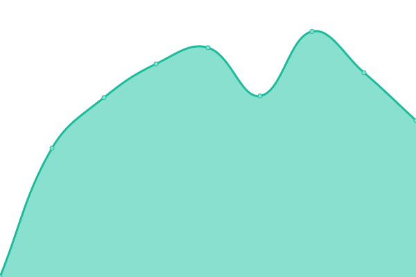

# [📈 Live Status](https://jershon.github.io/status-jershon): <!--live status--> **🟩 All systems operational**

This repository contains the open-source uptime monitor and status page for [Julien Jershon](https://jershon.github.io/status-jershon), powered by [Upptime](https://github.com/upptime/upptime).

With [Upptime](https://upptime.js.org), you can get your own unlimited and free uptime monitor and status page, powered entirely by a GitHub repository. We use [Issues](https://github.com/jershon/status-jershon/issues) as incident reports, [Actions](https://github.com/jershon/status-jershon/actions) as uptime monitors, and [Pages](https://jershon.github.io/status-jershon) for the status page.

<!--start: status pages-->
<!-- This summary is generated by Upptime (https://github.com/upptime/upptime) -->
<!-- Do not edit this manually, your changes will be overwritten -->
<!-- prettier-ignore -->
| URL | Status | History | Response Time | Uptime |
| --- | ------ | ------- | ------------- | ------ |
|  Jershon | 🟩 Up | [jershon.yml](https://github.com/jershon/status-jershon/commits/HEAD/history/jershon.yml) | 

 955ms
     
 | 

<a href="https://jershon.github.io/status-jershon/history/jershon">100.00%</a>
    

|  Cloud | 🟩 Up | [cloud.yml](https://github.com/jershon/status-jershon/commits/HEAD/history/cloud.yml) | 

 859ms
     
 | 

<a href="https://jershon.github.io/status-jershon/history/cloud">100.00%</a>
    

|  Domotique | 🟩 Up | [domotique.yml](https://github.com/jershon/status-jershon/commits/HEAD/history/domotique.yml) | 

 0ms
     
 | 

<a href="https://jershon.github.io/status-jershon/history/domotique">99.34%</a>
    

<!--end: status pages-->

[**Visit our status website →**](https://jershon.github.io/status-jershon)

## 📄 License

- Powered by: [Upptime](https://github.com/upptime/upptime)
- Code: [MIT](./LICENSE) © [Julien Jershon](https://jershon.github.io/status-jershon)
- Data in the `./history` directory: [Open Database License](https://opendatacommons.org/licenses/odbl/1-0/)
